# Module 1: SMUS 셋업 + 데이터 + Space + 로컬 IDE 연동

> ⏱️ 약 2시간 | 👤 난이도: 초급 (SMUS·AWS 처음이어도 OK)
>
> **이 모듈의 목표**
> 1. SageMaker Unified Studio(SMUS)에 내 데이터를 올린다
> 2. Space(클라우드 개발 환경)를 만든다
> 3. 내 로컬 **VS Code**를 그 Space에 연결한다
>
> 끝나면: "SMUS에 데이터가 있고, 내 로컬 IDE에서 그 환경에 접속해 작업할 수 있다" 상태가 됩니다.

---

## 0. 큰 그림 (먼저 읽기)

이번 워크샵에서 **SMUS의 역할은 딱 두 가지**입니다.

```
  SMUS  =  ① 데이터를 두는 곳   +   ② Space(개발/실행 컴퓨트 환경)

  실제 ML 모델·AI Agent 개발은?  →  내 로컬 VS Code + AI 코딩 도구로 직접 코드 작성
```

즉, SMUS의 복잡한 빌트인 기능은 거의 안 씁니다. **데이터를 올리고 → Space를 만들고 → 로컬 IDE로 연결**하는 것까지가 Module 1입니다.

> 📌 **참고**: 이 워크샵의 데이터는 어떤 것이든 상관없습니다(data-agnostic). 여기서는 샘플 CSV로 절차를 익히고, 실제 데이터는 나중에 같은 방법으로 교체하면 됩니다.

---

## 1. 사전 준비물 (시작 전 체크)

### 1.1 사전 확인 (강사/운영자)
- [ ] 워크샵용 **AWS 계정** + 관리자(Admin) 권한
- [ ] **IAM Identity Center**를 **워크샵 리전(예: us-east-1)** 에 켜둘 것
  - ⚠️ Identity Center는 계정당 1개이며 **켠 리전에 고정**됩니다. SMUS 도메인과 **같은 리전**이어야 합니다.
  - 이 문서는 "Identity Center와 SMUS 도메인을 **같은 리전**에 켠다"는 전제로 작성되었습니다.
- [ ] (참석자가 여러 명이면) Identity Center에 참석자별 SSO 사용자 미리 생성

### 1.2 참석자 로컬 PC에 설치 (시작 전 완료)
- [ ] **VS Code** — https://code.visualstudio.com
- [ ] VS Code 확장: **AWS Toolkit**, **Remote - SSH**
- [ ] **AWS CLI** — https://docs.aws.amazon.com/cli/latest/userguide/getting-started-install.html

> 💡 설치 확인 (터미널):
> ```bash
> code --version
> aws --version
> ```

---

## 2. SMUS 도메인 만들기 (Quick setup + IAM Identity Center)

> **도메인(Domain)** 은 SMUS의 최상위 공간입니다. 워크샵에서는 직접 하나 만듭니다.
> ⚠️ 비용: Quick setup은 VPC 등 리소스를 자동 생성하므로 과금됩니다. **워크샵 끝나면 도메인을 삭제**하세요.

**1.** AWS 콘솔에서 SageMaker 관리 콘솔로 이동: `https://console.aws.amazon.com/datazone`

**2.** 우측 상단 **리전 선택기**에서 **워크샵 리전(예: us-east-1)** 선택 (⚠️ IAM Identity Center를 켜둔 리전과 **동일**해야 합니다.)

**3.** **도메인** → **도메인 생성** 선택

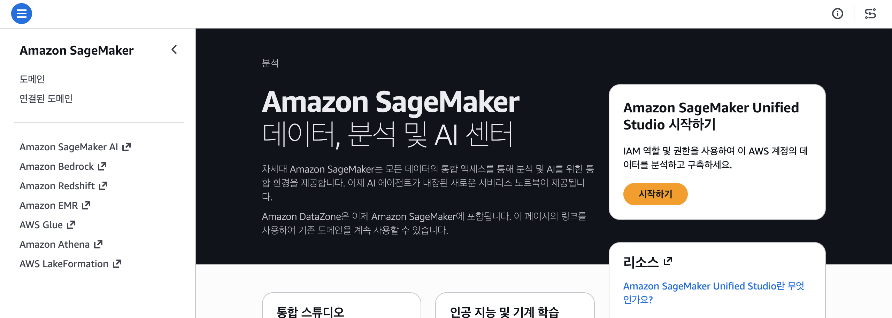

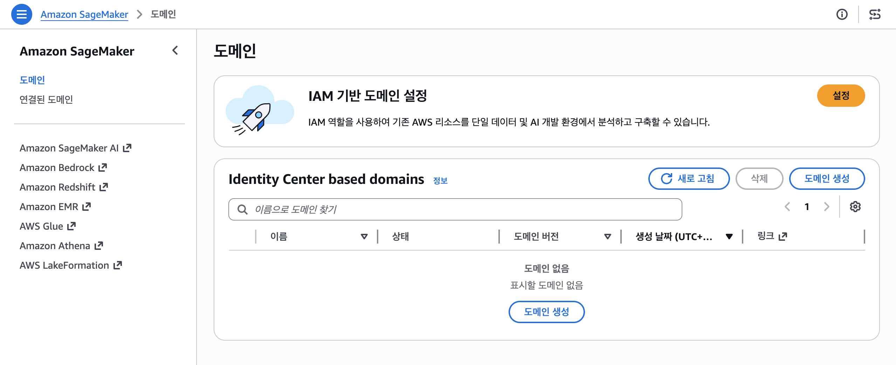

**4.** VPC 안내가 나오면 **VPC 생성** 클릭

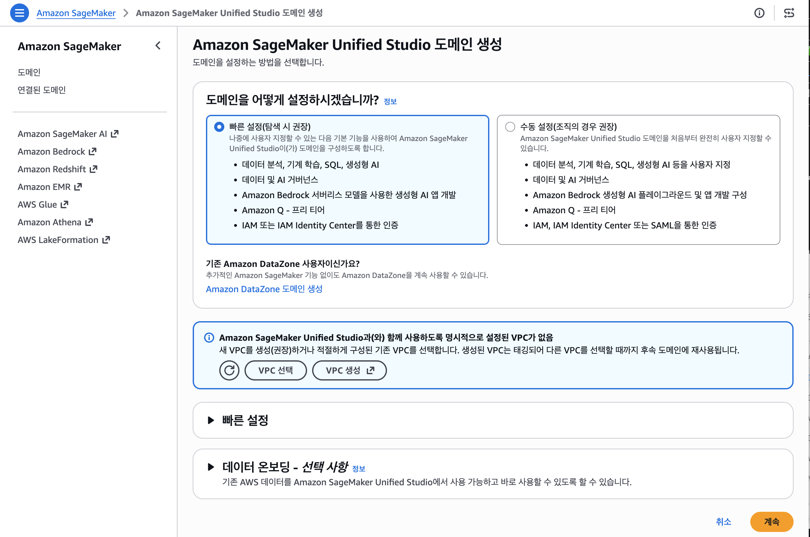

**5.** **빠른 스택 생성** 에서 **스택 생성** 클릭

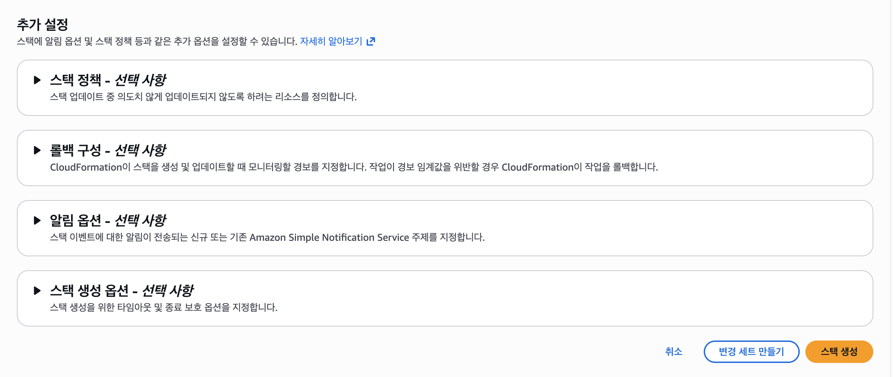

잠시 기다렸다가 완료 확인

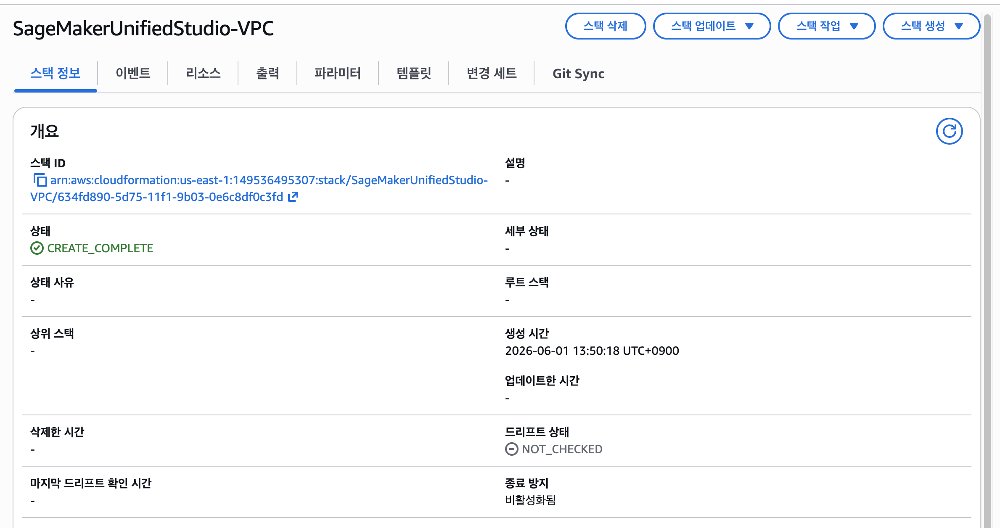

다시 SageMaker 설정 화면에서 **VPC 선택** 클릭시 방금 생성한 VPC로 설정 확인 후 **계속** 버튼 클릭

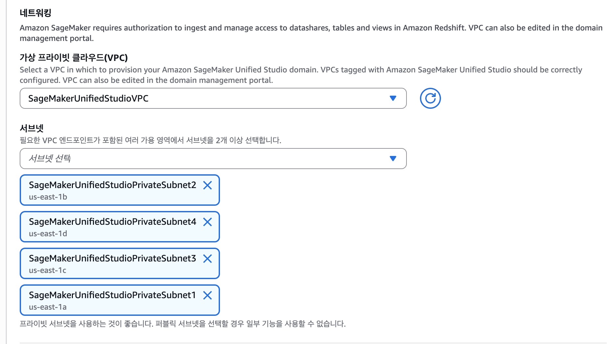

**6.** **IAM Identity Center 사용자 생성** 화면에서 개인 이메일과 이름 입력 (여기서 지정한 사용자가 SMUS **관리자**가 됩니다.)

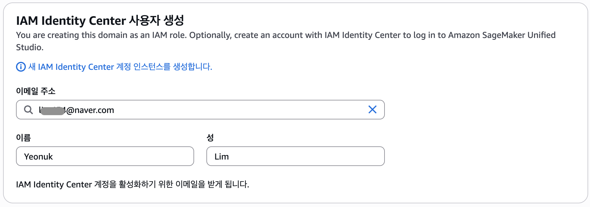

**7.** **도메인 생성** 클릭 → 생성 완료까지 대기 (수 분)

> 📧 SSO 사용자 이메일로 **초대 메일**이 옵니다. **Accept invitation** 버튼 눌러서 비밀번호를 설정하면 로그인 준비 완료.

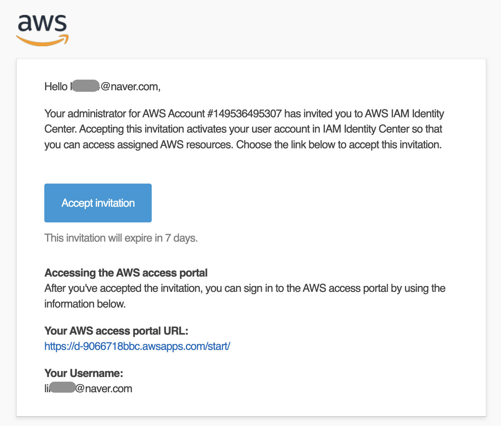

---

## 2.5 Bedrock 모델 권한 설정

> 도메인 생성 직후 바로 합니다. 나중에 Claude Code에서 Bedrock 호출이 안 되는 것을 방지합니다.

**1.** AWS 콘솔 → **IAM** → **역할(Roles)** 검색창에 `datazone_usr_role` 입력 → 본인 역할 클릭

**2.** **권한 추가** → **인라인 정책 생성** → **JSON** 탭에 아래 붙여넣기:

```json
{
  "Version": "2012-10-17",
  "Statement": [{
    "Effect": "Allow",
    "Action": [
      "aws-marketplace:ViewSubscriptions",
      "aws-marketplace:Subscribe"
    ],
    "Resource": "*"
  }]
}
```

**3.** **다음** → 정책 이름: `BedrockMarketplaceAccess` → **정책 생성**

> ✅ 이후 Bedrock 호출 시 2~3분 정도 전파 시간이 필요합니다. Space 생성하는 동안 자동으로 완료됩니다.

---

## 3. SMUS 포털 접속 & 프로젝트 열기

**1.** 도메인 상세 페이지의 **통합스튜디오 열기** 접속 (형식: `https://<domain-id>.sagemaker.<region>.on.aws`)

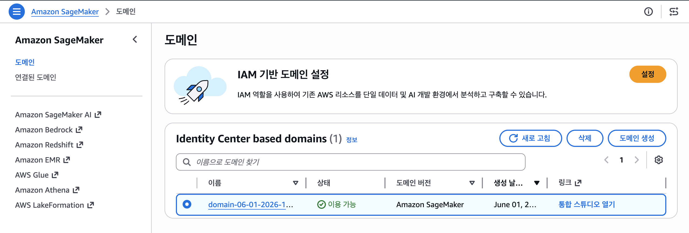

**2.** **IAM Identity Center(SSO)** 계정으로 로그인 (2단계에서 만든 사용자)

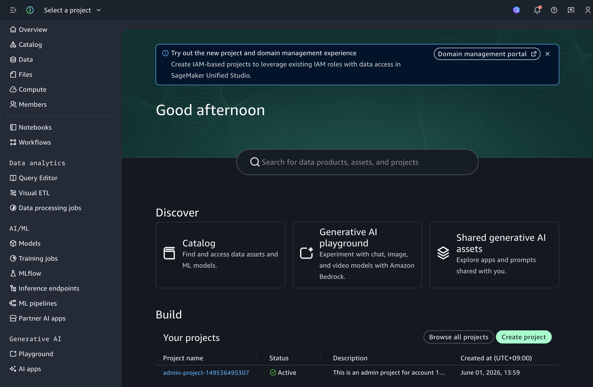

**3.** 미리 만들어진 **admin-project-** 클릭

> 🔎 **프로젝트(Project)란?** 데이터·환경·권한이 묶이는 작업 공간입니다. 워크샵 동안 우리는 이 프로젝트 하나 안에서 모든 걸 합니다.

---

## 4. 데이터 올리기 (가장 간단한 경로)

> 목표: 워크샵용 샘플 CSV(`occusynth.csv`)를 프로젝트에 올린다.

**1.** 워크샵용 샘플 데이터 다운로드 (브라우저에서 클릭하면 받아짐):

   👉 [occusynth.csv 다운로드](https://raw.githubusercontent.com/gonsoomoon-ml/ml-classification-with-agentic-coding/main/data/occusynth.csv) (약 47MB)

   > 이 데이터는 **Module 2(재실 감지 ML)** 의 학습용 raw 데이터입니다. 가전 전력 + 외기온 + `occupied`(재실 1/0) 라벨 포함.

**2.** 프로젝트 페이지 **중앙의 `Data` 섹션**을 찾습니다.

**3.** **S3 buckets** 클릭하고, **Project bucket** → **Amazon-sagemaker-** → **shared**를 누릅니다.

**4.** **shared** 오른쪽 메뉴 버튼을 누르고 **Upload files**를 클릭합니다.

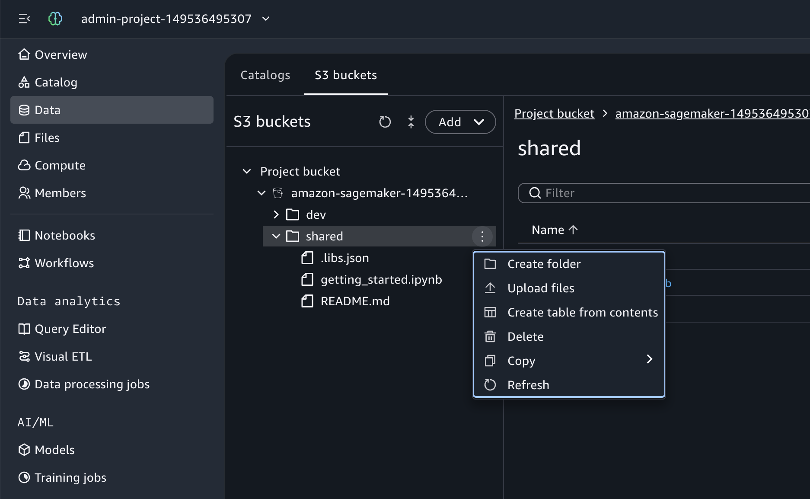

**5.** **Click to upload** 클릭하거나, 1번에서 다운로드한 **`occusynth.csv` 파일을 드래그 앤 드롭**

**6.** 업로드 완료를 기다립니다.

✅ 이제 데이터가 프로젝트에 등록되었습니다.

---

## 5. Space 만들기 (Remote Access 켜기)

> **Code Space**는 클라우드에 떠 있는 내 개발 환경(컴퓨트)입니다. 로컬 IDE를 여기에 연결합니다.

**1.** 프로젝트에서 **Compute** → **Spaces** 로 이동

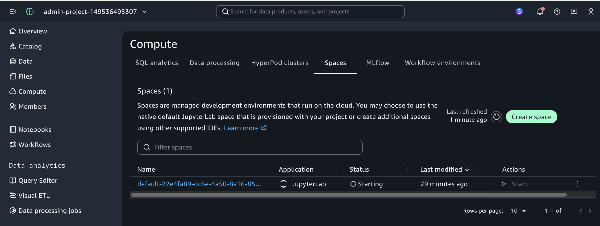

**2.** 새로운 Space를 생성하기 위해 **Create space**(Space 생성) 클릭

**3.** Space 이름 입력(e.g. SMUS-ML-Space) 그리고 Application을 **Code Editor**로 변경합니다. Instance 타입은 **ml.m5.xlarge**로 변경합니다. EBS Space Storage (GB)는 **50GB**로 변경합니다.

**4.** ⭐ **Remote Access** 토글을 **Enabled(켜기)** — **이게 핵심입니다.** 로컬 IDE 연결에 필수.

**5.** **Create and start space** → Space가 시작될 때까지 대기 (`Running` 상태까지 2분정도 대기가 필요)

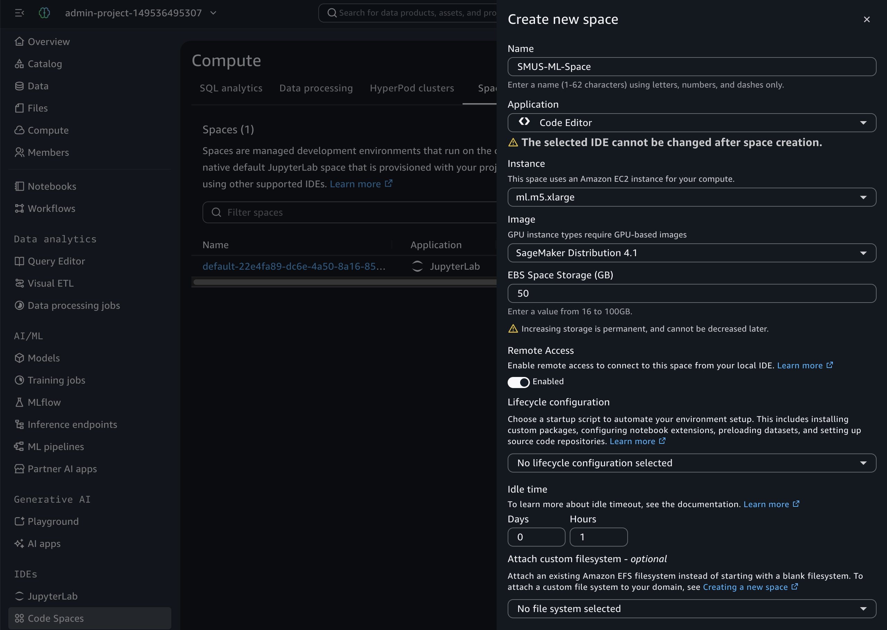

---

## 6. 로컬 IDE 연결하기

**1.** SMUS Studio UI에서 내 **Space** 화면으로 이동

**2.** **Open in VS Code** 버튼 클릭 (⚠️ VS Code가 **로컬 PC에 미리 설치**되어 있어야 합니다.)

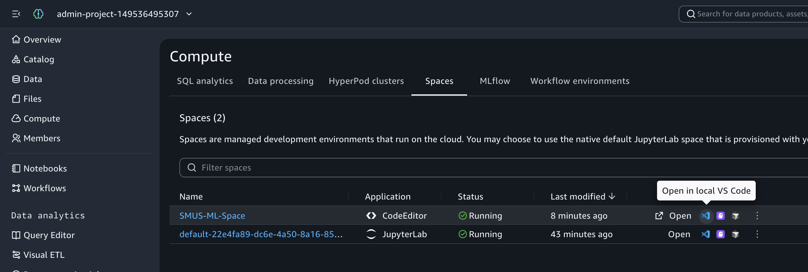

**3.** 로컬 VS Code가 자동으로 열리고, Space에 연결됩니다. 관련해서 팝업이 뜨면 확인이나 신뢰하기를 선택합니다.

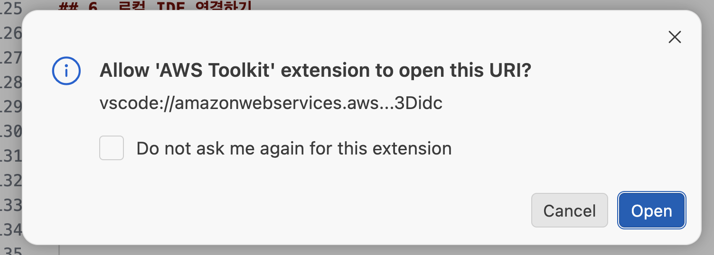

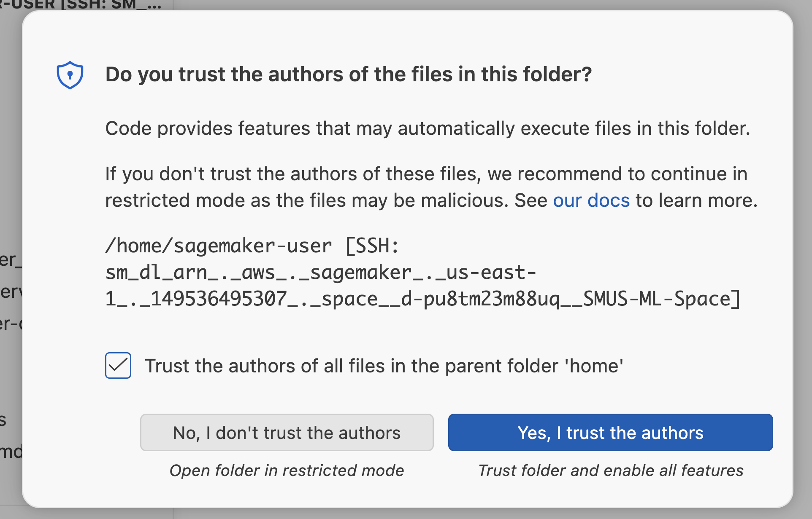

**4.** 이전 챕터에서 올린 데이터가 파일 탐색기에서 확인되는지 검사합니다.

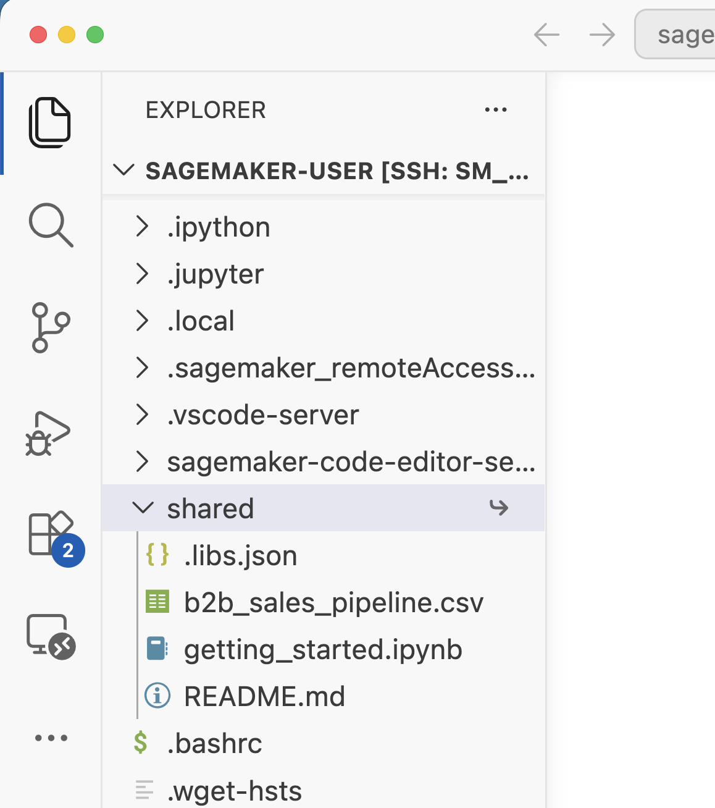

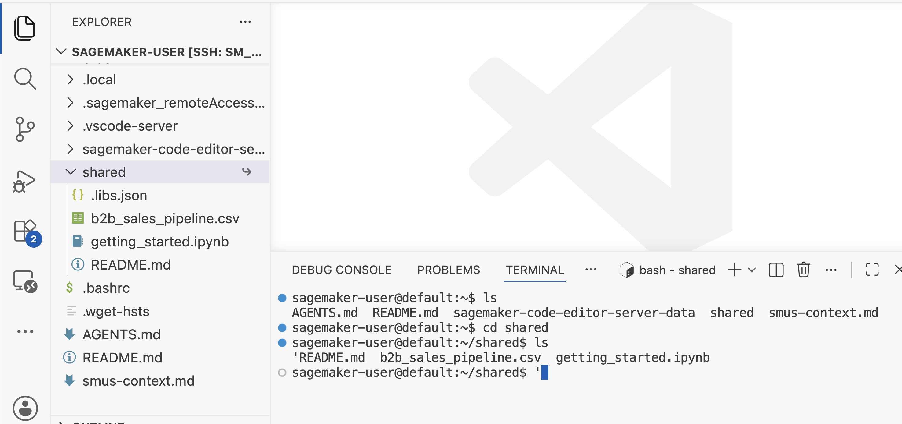

> ✅ 로컬이 아니라 **Space(클라우드)** 의 파일/환경이 보이면 연결 성공입니다.
> 이제부터 작업 무대는 이 IDE 창입니다. (Module 2·3은 여기서 진행)

---

## 7. Claude Code 셋팅하기 (Amazon Bedrock 연동)

> Module 2·3에서는 VS Code 터미널에서 **Claude Code**로 코드를 작성합니다.
> 핵심: Claude Code를 **Amazon Bedrock**에 연동합니다 (별도 Anthropic API 키 불필요 — Space의 AWS 자격증명을 그대로 사용).

> 📍 아래 명령은 **VS Code(= Space에 연결된 창)의 터미널** 에서 실행합니다.

### 7.1 Claude Code 설치

```bash
npm install -g @anthropic-ai/claude-code
claude --version   # 설치 확인
```

> Node.js가 없으면 먼저 설치하세요: `sudo apt-get update && sudo apt-get install -y nodejs npm` (또는 강사 안내)

### 7.2 Bedrock 모델 액세스 확인
- AWS 콘솔 → **Bedrock → Model access** 에서 사용할 Claude 모델이 활성화되어 있어야 합니다.
- 워크샵 리전(예: `us-east-1`)에 모델이 켜져 있는지 확인하세요.

### 7.3 Bedrock 연동 설정

Claude Code가 Anthropic API 대신 **Bedrock**을 쓰도록 환경변수를 설정합니다.

```bash
# Claude Code가 Bedrock을 사용하도록 전환
export CLAUDE_CODE_USE_BEDROCK=1
# 리전 (필수) — 모델이 켜진 리전으로
export AWS_REGION=us-east-1
```

> 매번 입력하지 않으려면 셸 프로필에 추가:
> ```bash
> echo 'export CLAUDE_CODE_USE_BEDROCK=1' >> ~/.bashrc
> echo 'export AWS_REGION=us-east-1' >> ~/.bashrc
> source ~/.bashrc
> ```

> 💡 **자격증명**: Claude Code는 표준 AWS 자격증명 체인을 사용합니다. SMUS Space에는 이미 AWS 자격증명이 있으므로 별도 설정이 보통 필요 없습니다. (`aws sts get-caller-identity`로 확인)

### 7.4 실행 및 확인

```bash
claude
```

- 처음 실행 시 안내가 나오면 진행합니다.
- 프롬프트에서 `/status` 를 입력해 **provider가 `Amazon Bedrock`** 으로 표시되는지 확인합니다.

> ✅ `/status`에 `Amazon Bedrock`이 보이면 연동 완료입니다. 이제 터미널에서 자연어로 코드를 작성할 수 있습니다.

> 🛟 **자주 막히는 곳**
> | 증상 | 해결 |
> |------|------|
> | `on-demand throughput isn't supported` | 모델 ID 대신 **inference profile ID**(`us.` 접두사) 사용 |
> | 리전 오류 / 모델 안 보임 | `AWS_REGION`을 모델이 켜진 리전으로. `aws bedrock list-inference-profiles --region <region>`로 확인 |
> | 자격증명 오류 | `aws sts get-caller-identity` 로 자격증명 유효성 확인 |

---

## ✅ Module 1 완료 체크리스트
- [ ] SMUS 도메인 생성 (Quick setup + IAM Identity Center, 워크샵 리전)
- [ ] SMUS 포털 로그인 + 프로젝트 진입
- [ ] 데이터 파일 업로드 완료
- [ ] Space 생성 (Remote Access **Enabled**)
- [ ] Bedrock 권한 설정 (`BedrockMarketplaceAccess` 인라인 정책 추가 + CLI 호출 확인)
- [ ] 로컬 VS Code 가 Space에 연결됨
- [ ] 터미널에서 Space 환경 확인 완료
- [ ] Claude Code 설치 + Bedrock 연동 (`/status`에 Amazon Bedrock 확인)

---

## 🛟 자주 막히는 곳 (Troubleshooting)

| 증상 | 원인 / 해결 |
|------|-------------|
| 도메인 생성 시 Identity Center 사용자 생성이 안 됨 | Identity Center가 **다른 리전**에 켜져 있음. 도메인과 **같은 리전**이어야 함 |
| "Open in VS Code" 버튼이 동작 안 함 | VS Code가 로컬에 설치 안 됨 → 설치 후 재시도 |
| AWS Toolkit에서 로그인 실패 | 도메인이 IAM Identity Center 기반인지 확인. URL 형식 확인 |
| Space 연결이 멈춤/타임아웃 | 도메인이 VPC-only면 NAT/프록시로 인터넷(SSH) 경로 필요 — 강사 확인 |
| 로컬 IDE 연동 옵션 자체가 없음 | IAM 기반 도메인은 미지원. **IAM Identity Center 기반** 도메인 필요 |

---

➡️ **다음**: Module 2 — 이 데이터를 가지고 로컬 IDE에서 코드로 ML 모델 만들기 
