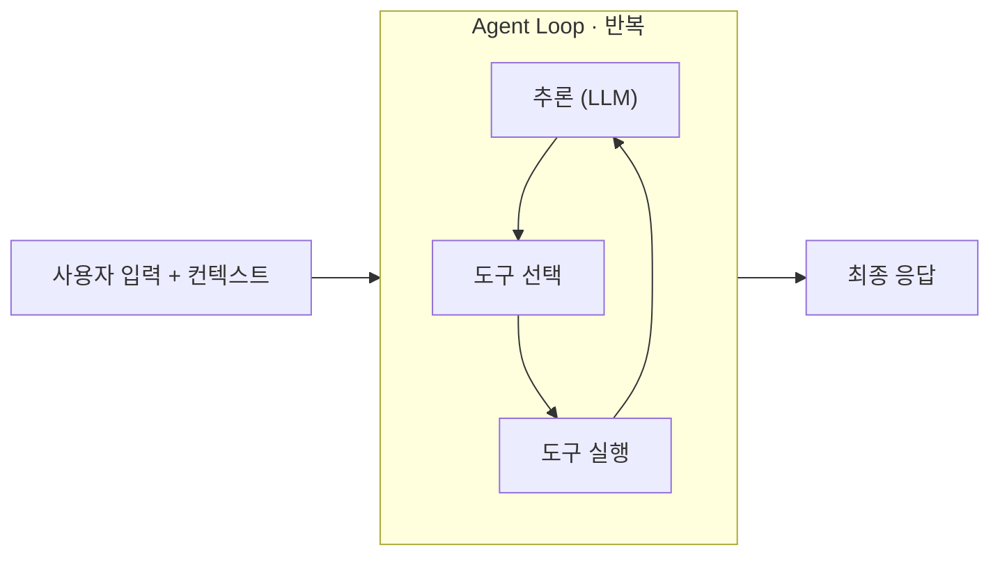
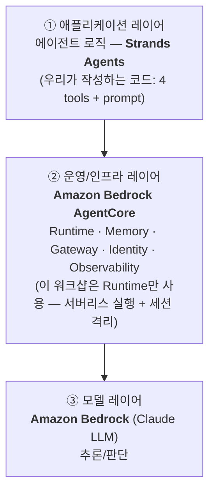

# Module 3: Agentic AI Agent 만들기 (Strands + AG-UI + CopilotKit + AgentCore)

> ⏱️ 약 3시간 | 👤 난이도: 중급 (Python 기본 가능하면 OK)
>
> **이 모듈에서 만드는 것**
> 1. **Strands Agents**로 펫케어 에이전트를 코드로 작성 (도구 4개)
> 2. **CopilotKit 채팅 UI**(웹)에 연결해서 로컬에서 대화
> 3. **Amazon Bedrock AgentCore Runtime**에 배포하고 **웹UI를 클라우드 에이전트에 연결** (AG-UI 유지 + Cognito 인증, 스크립트 원클릭)
>
> 끝나면: "신호를 종합해 스스로 판단·행동하는 에이전트"를 직접 만들고, 웹 UI로 대화하고, 클라우드에 올려본 상태가 됩니다.

> 🧭 **진행 방식**
> - 에이전트(Strands) 코드는 **복사-붙여넣기로 직접** 작성합니다 (핵심 학습).
> - 프론트엔드(CopilotKit)는 **제공된 GitHub 저장소를 clone**해서 그대로 씁니다 (양이 많고 핵심이 아님).
> - 목표는 엔터프라이즈 코드가 아니라 **Strands·AG-UI·AgentCore의 동작 원리 이해**입니다.

---

## 0. 우리가 만들 것 (시나리오)

**스마트싱스 펫케어 — 강아지 불안 케어 에이전트**

```
[재실 예측]  가전 전력 → 재실감지 ML 모델로 주인 재실 여부 예측  ← Module 2 모델
      ↓
[신호 수집]  강아지 디바이스 상태(짖음/움직임/소음)
      ↓
[판단]      "강아지 불안도" 예측
      ↓
[추론]      주인이 외출했고 불안도가 높으면? → 무엇을 할지 LLM이 결정
      ↓
[행동]      TV로 진정 음악 재생
```

### 핵심 개념
- 우리는 LLM에게 **도구(tool)** 만 쥐여주고, "언제 무엇을 쓸지"는 **에이전트가 스스로** 정합니다.
- 여러 신호를 LLM이 **종합 판단**하고, 행동을 **선택**하고, 이유를 **설명**합니다.

> ⚠️ 우리가 쓰는 건 **Strands Agents(오픈소스 프레임워크)** 입니다. Amazon Bedrock의 매니지드 "Agents" 기능이 아닙니다. LLM 추론만 Bedrock 모델을 씁니다.
>
> 🔗 **Module 2 연결**: `get_occupancy`는 Module 2의 **재실감지 ML 모델**(가전 전력 → 재실 여부)을 SageMaker 엔드포인트로 호출합니다. 엔드포인트가 없으면 Mock 폴백으로 동작합니다. 강아지 디바이스 신호와 불안도 예측은 Mock입니다.

### 전체 구조
```
[브라우저] CopilotKit 채팅 UI
      │
      ▼
[Next.js route.ts]  ──AG-UI 프로토콜──►  [Strands 에이전트]
      │                                       │
      │  • 로컬 모드: localhost:8080 (인증 없음)
      │  • 클라우드 모드: AgentCore Runtime (Cognito JWT)
      ▼                                       ▼
   .env.local 로 분기                    Bedrock 모델(LLM) + 도구 4개
```
> 같은 AG-UI 프로토콜이라 **프론트 코드는 그대로**, `.env.local`만 바뀌면 로컬↔클라우드를 오갑니다.

---

## 0.1 개념: AI Agent란?

LLM은 **질문에 답**할 수 있습니다. Agent는 **실제로 행동**할 수 있습니다. 그 차이를 만드는 것이 아래 구성요소입니다.

| 구성요소 | 역할 | 우리 펫케어 에이전트에서는 |
|----------|------|---------------------------|
| **Model (LLM)** | 추론·판단의 두뇌 | Bedrock Claude — 상황 종합 판단 |
| **Tools** | 외부 세계와 상호작용하는 능력 (API/함수 호출) | `get_occupancy`, `get_device_states`, `predict_anxiety`, `play_music_on_tv` |
| **Instructions (Prompt)** | 역할·목표·행동 규칙 | 시스템 프롬프트 ("외출+불안 high면 음악 재생") |
| **Memory** | 대화 맥락 유지 (단기/장기) | 대화 히스토리 (한 세션 내 맥락) |

> 💡 핵심: 개발자는 LLM에게 **도구만 쥐여주고**, "언제 어떤 도구를 쓸지"는 **에이전트가 스스로 판단**합니다. 이것이 `if-else` 자동화와 다른 점입니다.

---

## 0.2 개념: Strands Agents & Agent Loop

**Strands Agents**는 AWS의 오픈소스 에이전트 프레임워크입니다. `Model + Tools + Prompt`만 정의하면, "추론 → 도구 호출 → 결과 반영 → 다시 추론"을 반복하는 **Agent Loop**를 알아서 돌려줍니다.



**동작 방식** (펫케어 예시):
1. **추론**: "강아지 상태를 점검하려면 먼저 주인이 집에 있는지 봐야겠다"
2. **도구 선택 → 실행**: `get_occupancy()` 호출 → `away` (결과가 대화에 누적됨)
3. **다시 추론**: "외출 중이네. 이제 센서를 보자" → `get_device_states()` → `predict_anxiety()`
4. 충분한 정보가 모이면 **행동**(`play_music_on_tv`) 후 **최종 응답** 생성 (`end_turn`)

> 매 반복마다 도구 결과가 **대화 히스토리에 누적**되어, 모델이 여러 단계를 거쳐 스스로 판단을 발전시킵니다. 우리는 `@tool` 함수 4개만 작성하면 이 루프는 Strands가 처리합니다.

---

## 0.3 개념: Amazon Bedrock AgentCore (인프라 레이어)

코드로 만든 에이전트를 **프로덕션에서 안전하게 운영**하려면 서버·확장·보안·세션관리가 필요합니다. **AgentCore**는 그걸 대신 해주는 **에이전트 전용 인프라/운영 레이어**입니다.



- **① Strands** = 에이전트 로직(무엇을 어떻게 할지)을 코드로 작성
- **② AgentCore** = 그 에이전트를 **배포·실행·운영**하는 인프라 레이어
- **③ Bedrock** = 에이전트가 추론에 사용하는 **LLM(모델)** 제공
- AgentCore는 7개 매니지드 서비스(Runtime / Memory / Identity / Gateway / Code Interpreter / Browser / Observability)로 구성되며, **필요한 것만 골라 쓸 수 있습니다.**
- **이 워크샵에서는 `Runtime` 하나만** 사용합니다 — 우리가 만든 Strands 에이전트를 서버리스로 배포·실행하는 부분(섹션 5).

> ⚠️ AgentCore는 Amazon Bedrock의 매니지드 "Agents" 기능과 **다릅니다**. 에이전트 로직은 우리가 Strands로 직접 작성하고, AgentCore는 그걸 올려 돌리는 실행 환경입니다.

---

## 1. 환경 준비

> Module 1에서 연결한 **VS Code(= SMUS Space에 연결된 창)** 의 터미널에서 진행합니다.

### 1.1 제공된 프로젝트 clone

```bash
git clone https://github.com/yeonuk-lim/smus-petcare-agent.git
cd smus-petcare-agent
```

구조:
```
smus-petcare-agent/
├── agent/        # Strands 에이전트 백엔드 (← 이번 모듈에서 직접 작성해볼 부분)
│   ├── main.py
│   └── requirements.txt
└── frontend/     # CopilotKit 채팅 UI (그대로 사용)
```

### 1.2 Bedrock 모델 액세스 확인
- Module 1에서 도메인 생성 시 **Grant model access**로 Bedrock 모델 접근을 허용했어야 합니다.
- 안 했다면 AWS 콘솔 → Bedrock → **Model access**에서 사용할 모델(Claude)을 활성화하세요.

> ⚠️ **리전 주의**: 이 워크샵은 `us-east-1`에서 Claude Sonnet 모델을 사용합니다. 리전마다 모델 접근이 다릅니다.

---

## 2. 에이전트 코드 이해하기 (`agent/main.py`)

`agent/main.py`를 열어 한 부분씩 봅니다. (clone한 코드에 이미 들어 있습니다 — 직접 타이핑해보고 싶으면 빈 파일에 따라 쳐도 됩니다.)

### 2.1 도구(Tool) — `@tool` 데코레이터

Strands에서 도구는 그냥 **`@tool`을 붙인 파이썬 함수**입니다.
함수의 **docstring과 타입힌트**가 그대로 LLM에게 "이 도구가 뭔지" 설명으로 전달됩니다.

#### (A) `get_occupancy` — Module 2 재실감지 ML 모델 호출

가전 전력 feature 14개로 **주인 재실 여부**를 예측합니다. Module 2에서 만든 SageMaker 엔드포인트를 호출하고, 엔드포인트가 없으면 Mock으로 동작합니다.
feature 14개는 실제로는 전력 미터에서 계산되지만, 여기서는 **Mock으로 생성**합니다.

```python
import os, json, random
from strands import tool


def _mock_power_features() -> dict:
    """Module 2(재실 감지 ML)의 입력 feature 14개를 Mock으로 생성한다."""
    high = random.random() > 0.5  # 전력 높음(활동) vs 낮음(빈집)
    agg = round(random.uniform(500, 1600) if high else random.uniform(60, 200), 1)
    return {
        "aggregate_w": agg, "minute_of_day": random.randint(0, 1439),
        "dow": random.randint(0, 6), "is_daylight": random.choice([0, 1]),
        "month": random.choice([6, 7, 8, 9]), "outdoor_temp_c": round(random.uniform(20, 34), 1),
        "aggregate_missing": 0.0, "agg_roll_mean_30": round(agg * random.uniform(0.8, 1.1), 1),
        "agg_roll_std_30": round(random.uniform(100, 400) if high else random.uniform(0, 60), 1),
        "agg_delta_15": round(random.uniform(50, 500) if high else random.uniform(-80, 80), 1),
        "aircon_active_30": float(random.randint(0, 30)) if high else 0.0,
        "kettle_active_30": 0.0, "microwave_active_30": 0.0,
        "tv_active_30": float(random.randint(0, 30)) if high else 0.0,
    }


@tool
def get_occupancy() -> dict:
    """가전 전력 데이터로 주인의 재실 여부를 예측한다 (Module 2의 재실감지 ML 모델 호출).
    occupancy('home'/'away'), proba_occupied(0~1)를 반환한다."""
    features = _mock_power_features()
    endpoint = os.getenv("SM_ENDPOINT_NAME")
    if endpoint:  # Module 2 SageMaker 엔드포인트 호출
        import boto3
        rt = boto3.client("sagemaker-runtime", region_name=os.getenv("AWS_REGION", "us-east-1"))
        resp = rt.invoke_endpoint(EndpointName=endpoint, ContentType="application/json",
            Accept="application/json", Body=json.dumps({"buffer": [features]}))
        proba = json.loads(resp["Body"].read())[0]["proba_occupied"]
    else:  # Mock 폴백: 전력 수준 기반
        proba = min(0.99, max(0.01, features["aggregate_w"] / 1500))
    return {"occupancy": "home" if proba > 0.5 else "away", "proba_occupied": round(proba, 3)}
```

> 🔗 곤수님 Module 2의 `launch_invoke.py`와 동일한 호출 규약입니다: `{"buffer": [record]}` 전송 → `[{"proba_occupied":..., "pred_occupied":...}]` 응답.
> `SM_ENDPOINT_NAME` 환경변수만 설정하면 실제 모델로, 없으면 Mock으로 동작합니다.

#### (B) 나머지 도구 — 강아지 디바이스/행동 (Mock)

```python
@tool
def get_device_states() -> dict:
    """강아지 관련 디바이스 센서 값을 읽는다.
    barking_level(짖음 0~10), motion(움직임 0~10), noise_db(소음 데시벨)을 반환."""
    return {
        "barking_level": random.randint(0, 10),
        "motion": random.randint(0, 10),
        "noise_db": random.randint(30, 90),
    }


@tool
def predict_anxiety(barking_level: int, motion: int, noise_db: int) -> dict:
    """디바이스 센서 값으로 강아지의 불안도를 예측한다.
    score(0.0~1.0)와 level('low'/'medium'/'high')을 반환."""
    score = min(1.0, (barking_level + motion + (noise_db - 30) / 6) / 25)
    level = "high" if score > 0.6 else "medium" if score > 0.3 else "low"
    return {"score": round(score, 2), "level": level}


@tool
def play_music_on_tv(playlist: str = "Calm Dog Music") -> str:
    """TV에서 강아지 진정용 음악을 재생한다."""
    return f"TV에서 '{playlist}' 재생을 시작했습니다."
```

> 💡 `predict_anxiety`의 입력은 `get_device_states`의 출력과 맞춰져 있습니다. 그래서 에이전트가 "상태 읽기 → 불안도 예측" 순서로 도구를 엮어 씁니다.

### 2.2 에이전트 + AG-UI 래핑

```python
import os
os.environ["BYPASS_TOOL_CONSENT"] = "true"   # 도구 실행 동의 프롬프트 생략(데모용)

from strands import Agent
from strands.models import BedrockModel
from ag_ui_strands import StrandsAgent, StrandsAgentConfig, create_strands_app

SYSTEM_PROMPT = """너는 스마트싱스 반려견 펫케어 에이전트다.
요청을 받으면 도구를 사용해 다음을 수행해라:
1. get_occupancy 로 주인의 재실 여부를 확인한다 (가전 전력 기반 ML 예측, occupancy='home'/'away').
2. get_device_states 로 디바이스 센서 값을 읽는다.
3. predict_anxiety 로 강아지의 불안도를 예측한다.
4. 주인이 외출(occupancy='away') 중이고 불안도가 'high'이면, play_music_on_tv 로 진정 음악을 재생한다.
   그 외에는 아무 행동도 하지 않는다.
마지막에 점검 결과와 무엇을 왜 했는지 한국어로 간단히 설명해라."""

model = BedrockModel(
    model_id="us.anthropic.claude-sonnet-4-5-20250929-v1:0",
    region_name="us-east-1",
)

agent = Agent(
    model=model,
    system_prompt=SYSTEM_PROMPT,
    tools=[get_occupancy, get_device_states, predict_anxiety, play_music_on_tv],
)

# AG-UI 프로토콜로 감싸기 (CopilotKit이 말을 거는 방식)
agui_agent = StrandsAgent(
    agent=agent,
    name="petcare_agent",
    description="스마트싱스 펫케어 - 강아지 불안 케어 에이전트",
    config=StrandsAgentConfig(),
)

# 로컬은 "/", AgentCore Runtime은 "/invocations" 로 접근
agent_path = os.getenv("AGENT_PATH", "/invocations")
app = create_strands_app(agui_agent, agent_path)

if __name__ == "__main__":
    import uvicorn
    uvicorn.run("main:app", host="0.0.0.0", port=int(os.getenv("PORT", "8080")))
```

**핵심 포인트**
- `create_strands_app(agui_agent, path)` 가 **AG-UI 프로토콜을 말하는 HTTP 서버**를 만들어 줍니다. (`/ping` 헬스체크 내장)
- `path`가 로컬에서는 `/`, AgentCore에서는 `/invocations` — 환경변수로 분기.
- `BYPASS_TOOL_CONSENT=true`가 없으면 도구 실행마다 동의 프롬프트가 떠서 자동 실행이 막힙니다.

---

## 3. 백엔드 실행 (로컬)

> ⚠️ **Python 3.12 필요**: `ag-ui-strands`는 Python 3.14를 아직 지원하지 않습니다. 반드시 3.12로 가상환경을 만드세요.

### 3.1 Module 2 엔드포인트 연결 (필수)

Module 2에서 배포한 SageMaker 엔드포인트 이름을 환경변수로 가져옵니다. Module 2 작업 폴더에 가서 `.env` 파일에 적힌 `SM_ENDPOINT_NAME` 값을 export 하면 됩니다.

```bash
# Module 2 폴더로 이동 (clone한 위치)
cd ~/ml-classification-with-agentic-coding

# .env 파일에서 SM_ENDPOINT_NAME 값을 그대로 export
export $(grep '^SM_ENDPOINT_NAME=' .env | xargs)

# 확인
echo $SM_ENDPOINT_NAME    # 예: occusynth-occ-734a3909
```

> 💡 이 환경변수가 설정돼 있으면 `get_occupancy` tool이 **실제 SageMaker 엔드포인트를 호출**합니다. 없으면 Mock 폴백으로 동작합니다.

### 3.2 백엔드 기동

```bash
# Module 3 sample-app 의 agent 폴더로 이동
cd ~/smus-petcare-agent/agent
python3.12 -m venv .venv
source .venv/bin/activate
pip install -r requirements.txt

# 로컬 모드: AGENT_PATH=/ 로 띄움 (SM_ENDPOINT_NAME은 위에서 export된 값을 그대로 사용)
AGENT_PATH="/" AWS_REGION=us-east-1 python main.py
```

다른 터미널에서 헬스체크:
```bash
curl http://localhost:8080/ping
# {"status":"healthy"}
```

> ✅ `{"status":"healthy"}`가 나오면 에이전트 서버가 정상 기동된 것입니다.

---

## 4. 프론트엔드 실행 (CopilotKit 채팅 UI)

새 터미널에서:

```bash
cd frontend
npm install
npm run dev                         # http://localhost:3300
```

> `.env.local`은 기본값이 **로컬 모드**(`AGENT_URL=http://localhost:8080`)로 들어 있어 그대로 쓰면 됩니다.

브라우저에서 **http://localhost:3300** 접속 → 오른쪽 사이드바 채팅에 입력:

```
강아지 상태 점검해줘
```

> ✅ 에이전트가 도구를 차례로 호출(`get_occupancy → get_device_states → predict_anxiety`)하고,
> 상황에 따라 `play_music_on_tv`까지 실행한 뒤, 점검 결과와 이유를 사이드바에 보여주면 성공입니다.
> 🔁 `get_occupancy`가 랜덤이라 여러 번 보내면 다른 판단(음악 재생 / 무동작)을 볼 수 있습니다.

### 동작 원리 (한 장 요약)
```
브라우저 채팅 입력
   → /api/copilotkit (route.ts) → HttpAgent(AGENT_URL) 로 AG-UI 요청
   → localhost:8080 Strands 에이전트가 도구 호출하며 추론
   → 결과를 AG-UI 이벤트로 스트리밍 → 사이드바에 표시
```

> 💡 지금은 **로컬 모드**라 `frontend/.env.local`의 `AGENT_URL`로 붙고 **인증이 없습니다.** 다음 섹션 5에서 이 그대로를 **클라우드(AgentCore Runtime)** 에 올리고 **Cognito 인증**을 붙입니다 — 프론트 코드는 그대로 두고요.

---

## 🎯 미션 1: 나만의 Tool을 에이전트에 추가하기 (Claude Code 활용)

> **목표**: 로컬에서 에이전트가 정상 동작하는 걸 확인한 뒤, **Claude Code의 도움을 받아** 새 Tool을 직접 만들어 에이전트에 추가합니다.

### 미션 전 확인 (필수)

섹션 3·4가 완료된 상태여야 합니다:
- `curl http://localhost:8080/ping` → `{"status":"healthy"}`
- 브라우저 **http://localhost:3300** → 사이드바 채팅에서 `강아지 상태 점검해줘` 입력 → 에이전트가 도구를 호출하며 결과를 설명하는 걸 확인

### 미션 내용

`agent/main.py`에 새로운 `@tool` 함수를 하나 추가하고, 에이전트가 **새 질문**에 그 도구를 써서 답하도록 만드세요.

예시 아이디어 (하나를 골라도 되고 직접 만들어도 됩니다):

| 아이디어 | 설명 | 새 질문 예시 |
|----------|------|-------------|
| `get_weather(location)` | 현재 기온/날씨 Mock 반환 | "오늘 날씨 어때?" |
| `get_feeding_schedule()` | 강아지 밥 시간 Mock 반환 | "밥 줄 시간 됐어?" |
| `check_water_bowl()` | 물그릇 수위 Mock 반환 | "물은 충분해?" |
| `get_activity_summary()` | 오늘 활동량 Mock 반환 | "오늘 강아지 얼마나 움직였어?" |

### Claude Code로 진행하는 방법

```bash
# VS Code 터미널에서 Claude Code 실행
claude
```

프롬프트 예시:
```
agent/main.py에 강아지 물그릇 수위를 확인하는 check_water_bowl 툴을 추가해줘.
물 부족이면 level='low', 충분하면 'ok'를 반환하는 Mock으로 만들고,
에이전트 시스템 프롬프트에도 이 툴을 언제 쓸지 설명을 추가해줘.
```

### 완료 기준

1. `agent/main.py`에 `@tool` 함수가 1개 이상 추가됨
2. 에이전트를 재시작 (`Ctrl+C` → `python main.py`)
3. 채팅창에 새 Tool에 맞는 질문 입력 → **에이전트가 새 Tool을 호출하며 답변**

> 💡 `@tool`의 **docstring이 곧 LLM의 도구 설명**입니다. docstring이 명확할수록 에이전트가 언제 이 도구를 써야 할지 잘 판단합니다.
> 시스템 프롬프트에 "어떤 질문이 오면 이 도구를 써라"는 문장을 추가하면 더 확실하게 동작합니다.

---

## 5. AgentCore Runtime에 배포 + 웹UI 클라우드 연결 (AG-UI + Cognito)

이제 로컬에서 잘 도는 에이전트를 클라우드(**AgentCore Runtime**)에 올리고, **CopilotKit 웹UI를 그대로 클라우드 에이전트에 연결**합니다.

- 프로토콜은 로컬과 동일한 **AG-UI** 를 유지합니다 (`--protocol AGUI`).
- 인증은 **Cognito(JWT)** 를 씁니다. 브라우저는 인증을 몰라도 되고, **Next.js 서버(route.ts)가 Cognito 토큰을 받아 대신 호출**합니다.
- 이 모든 과정(Cognito 생성 → 배포 → 프론트 연결)을 **스크립트 하나로** 처리합니다.

> 🧭 **왜 AG-UI를 유지하나?** 로컬에서 쓰던 `create_strands_app`(AG-UI 서버)을 그대로 클라우드에 올리는 구조라, **프론트 코드 변경 없이** `.env.local`만 바뀌면 로컬↔클라우드를 오갈 수 있습니다.

### 5.1 starter toolkit 설치

```bash
cd ../agent          # 에이전트 폴더에서 (로컬 실행에 쓴 .venv 그대로)
source .venv/bin/activate
pip install bedrock-agentcore-starter-toolkit
```

### 5.2 원클릭 배포 스크립트 실행

제공된 `deploy-agentcore.sh` 하나면 **Cognito 생성 → AG-UI+JWT 설정 → 배포 → ARN 조회 → 프론트 `.env.local` 자동 기록**까지 끝납니다.

```bash
./deploy-agentcore.sh
```

스크립트가 하는 일 (한 단계씩):
1. `agentcore identity setup-cognito` — Cognito 사용자 풀 생성, 자격정보를 `.agentcore_identity_user.env`에 저장
2. `agentcore configure -e main.py --protocol AGUI --authorizer-config '{...customJWTAuthorizer...}'` — **AG-UI 프로토콜 + Cognito JWT 인증**으로 배포 설정
3. `agentcore deploy --auto-update-on-conflict` — arm64 컨테이너 빌드 → ECR → Runtime 생성 (CodeBuild, Docker 불필요)
4. `aws bedrock-agentcore-control list-agent-runtimes` — 방금 만든 **Runtime ARN** 조회
5. `../frontend/.env.local` 에 **ARN·리전·Cognito 정보**를 자동 기록

> ⏱️ 컨테이너 빌드+배포는 보통 몇 분 걸립니다. `✅ 완료!` 메시지가 나오면 성공입니다.
> 📋 중간에 출력되는 **Agent Runtime ARN**도 확인해 두세요.

> 🔐 **인증 흐름**: 브라우저 → Next.js `route.ts`(Cognito Access Token 발급) → `Authorization: Bearer <token>` 로 AgentCore invoke URL 호출 → Runtime이 JWT 검증 후 실행. 토큰 발급은 **클라이언트 시크릿 없는** Cognito 앱 클라이언트(`USER_PASSWORD_AUTH`)로 합니다.

### 5.3 웹UI를 클라우드 에이전트에 연결

스크립트가 이미 `frontend/.env.local`을 클라우드 모드로 바꿔놨습니다. 프론트엔드만 다시 띄우면 됩니다.

```bash
cd ../frontend
npm run dev        # http://localhost:3300
```

브라우저에서 **http://localhost:3300** → 채팅에 `강아지 상태 점검해줘` 입력.

> ✅ 로컬 때와 **똑같은 화면**이지만, 이제 실제 요청은 **클라우드 AgentCore Runtime**에서 처리됩니다.
> (로컬 에이전트 `python main.py`는 꺼져 있어도 됩니다.)

`frontend/.env.local`은 이렇게 바뀌어 있습니다 (스크립트 자동 생성):
```bash
AGENTCORE_RUNTIME_ARN=arn:aws:bedrock-agentcore:us-east-1:...:runtime/petcare_agent-xxxx
AGENTCORE_REGION=us-east-1
COGNITO_POOL_REGION=us-east-1
COGNITO_CLIENT_ID=...
COGNITO_USERNAME=...
COGNITO_PASSWORD=...
```

> 🔁 **로컬로 되돌리기**: `.env.local`의 위 줄들을 지우고 `AGENT_URL=http://localhost:8080` 한 줄만 남기면 됩니다. `route.ts`는 `AGENTCORE_RUNTIME_ARN`이 있으면 클라우드, 없으면 로컬로 자동 분기합니다.

### 5.4 (선택) CLI로 빠르게 호출 확인

웹UI 없이 배포가 잘 됐는지만 확인하려면:

```bash
# Cognito 토큰 발급 → 그 토큰으로 invoke
export $(grep -v '^#' .agentcore_identity_user.env | xargs)
TOKEN=$(agentcore identity get-cognito-inbound-token)
agentcore invoke '{"messages":[{"id":"1","role":"user","content":"강아지 상태 점검해줘"}],"runId":"r1","threadId":"t1","state":{},"tools":[],"context":[],"forwardedProps":{}}' --bearer-token "$TOKEN"
```

> ⚠️ 이 에이전트는 **AG-UI 서버**라서 호출 본문은 `{"prompt": ...}`가 아니라 위처럼 **AG-UI 형식**(`messages/runId/threadId/...`)이어야 합니다. 웹UI(CopilotKit)는 이 형식을 자동으로 만들어 보냅니다.

---

## 🎯 미션 2: 클라우드에 배포하고 웹UI로 접속하기

> **목표**: 미션 1까지 완성된 에이전트를 **AgentCore Runtime에 배포**하고, CopilotKit 웹UI를 **EC2에 올려서 브라우저로 직접 접속**해 보세요. 로컬 에이전트·로컬 프론트 없이 전부 클라우드에서 동작하는 완전한 구성을 만드는 게 목표입니다.

### 미션 내용

#### Step 1 — 에이전트 클라우드 배포

```bash
cd ~/smus-petcare-agent/agent
source .venv/bin/activate
pip install bedrock-agentcore-starter-toolkit   # 아직 안 했으면
./deploy-agentcore.sh
```

`✅ 완료!` 메시지가 나오면 `frontend/.env.local`이 **클라우드 연결 정보로 자동 교체**됩니다.

#### Step 2 — 프론트엔드를 EC2에 배포

EC2 인스턴스가 하나 필요합니다. 없으면 AWS 콘솔에서 `t3.small` / Amazon Linux 2023 / 퍼블릭 IP 허용으로 하나 만드세요. 포트 3000을 허용하는 보안 그룹 규칙을 추가합니다.

**① 로컬에서 빌드**

```bash
cd ~/smus-petcare-agent/frontend
# .env.local에 클라우드 연결 정보가 채워져 있는지 확인
cat .env.local | grep AGENTCORE_RUNTIME_ARN

npm run build   # .next/ 디렉토리 생성
```

**② 빌드 결과를 EC2로 전송**

```bash
# .next/, package.json, public/ 을 묶어서 전송
tar czf /tmp/frontend-build.tar.gz .next package.json package-lock.json public/ .env.local next.config.ts

scp /tmp/frontend-build.tar.gz ec2-user@<EC2_PUBLIC_IP>:/home/ec2-user/
```

> `<EC2_PUBLIC_IP>` 자리에 실제 EC2 퍼블릭 IP를 넣으세요.
> SSH 키가 필요하면 `-i ~/.ssh/<your-key>.pem` 옵션을 추가합니다.

**③ EC2에서 실행**

```bash
ssh ec2-user@<EC2_PUBLIC_IP>
cd ~
tar xzf frontend-build.tar.gz
npm install --omit=dev       # node_modules 설치 (node 없으면 먼저 설치)
npx next start -p 3000       # 포트 3000으로 실행
```

> Node.js가 없으면 먼저 설치:
> ```bash
> curl -fsSL https://rpm.nodesource.com/setup_20.x | sudo bash -
> sudo yum install -y nodejs
> ```

#### Step 3 — 브라우저로 접속해 에이전트와 대화

브라우저에서 **`http://<EC2_PUBLIC_IP>:3000`** 접속 → 채팅창에 입력:

```
강아지 상태 점검해줘
```

로컬 터미널을 전부 닫아도 EC2의 웹UI → AgentCore Runtime으로 이어지는 구성이면 성공입니다.

> 💡 EC2를 껐다 켜도 프론트가 자동 실행되길 원하면, `nohup npx next start -p 3000 &` 로 백그라운드 실행하거나 systemd 서비스로 등록하세요.

### 완료 기준

- [ ] `deploy-agentcore.sh` 완료 → `AGENTCORE_RUNTIME_ARN`이 `.env.local`에 기록됨
- [ ] `npm run build` 성공 → `.next/` 생성
- [ ] EC2에서 `npx next start` 실행
- [ ] 브라우저 `http://<EC2_IP>:3000` 접속 → 에이전트 응답 수신
- [ ] (보너스) 미션 1에서 추가한 Tool도 클라우드에서 동작하는지 확인

---

## ✅ Module 3 완료 체크리스트
- [ ] 저장소 clone + 에이전트 코드(`main.py`) 이해
- [ ] 백엔드 로컬 실행 (`/ping` healthy)
- [ ] 프론트엔드(CopilotKit) 실행 + 채팅으로 에이전트 동작 확인
- [ ] **[미션 1]** Claude Code로 새 `@tool` 추가 → 새 질문에 동작 확인
- [ ] `deploy-agentcore.sh`로 AgentCore Runtime 배포 (AG-UI + Cognito)
- [ ] **[미션 2]** EC2에 프론트 배포 → `http://<EC2_IP>:3000` 브라우저 접속 + 에이전트 응답 확인

---

## 🛟 자주 막히는 곳 (Troubleshooting)

| 증상 | 원인 / 해결 |
|------|-------------|
| `ag-ui-strands` 설치/실행 오류 | Python 3.14는 미지원 → **3.12로 venv** 생성 |
| `AccessDenied` / 모델 호출 실패 | Bedrock **Model access** 미허용 → 콘솔에서 모델 활성화 (리전 `us-east-1`) |
| `/ping`은 되는데 채팅 무응답 | `frontend/.env.local`의 `AGENT_URL`이 `http://localhost:8080`인지 확인 |
| 에이전트가 도구를 안 부름 | docstring/타입힌트가 부실 → 설명을 더 명확히 |
| 도구 실행마다 멈춤 | `BYPASS_TOOL_CONSENT=true` 누락 |
| 채팅에 "Big update" 배너 | `npm install` 시 `scripts/patch-copilotkit.js`(postinstall)가 자동 제거. 안 되면 `npm run postinstall` |
| 포트 3300 이미 사용 중 | `frontend/package.json`의 dev 포트 변경 |
| `deploy-agentcore.sh` 실패 | AWS 자격증명/리전 확인 (`aws sts get-caller-identity`), `.venv` 활성화 + starter toolkit 설치 확인 |
| 클라우드 연결 후 채팅 무응답 | `frontend/.env.local`에 `AGENTCORE_RUNTIME_ARN`·`COGNITO_*`가 채워졌는지 확인. 비었으면 스크립트 재실행 |
| `Authorization method mismatch` | 배포는 JWT인데 호출이 SigV4(혹은 반대). 스크립트로 배포했으면 **JWT(Bearer)** 로 호출해야 함 |
| `agentcore invoke` 400/422 | 본문이 `{"prompt":...}`면 실패. **AG-UI 형식**(`messages/runId/threadId/...`)으로 보내야 함 (5.4 참고) |
| Runtime이 READY가 안 됨 | `main.py`에 `/ping`(200)이 있는지 확인 (AG-UI도 헬스체크 필요) |

> 🧹 **워크샵 종료 후**: 배포한 AgentCore Runtime과 ECR 이미지를 삭제해 과금을 막으세요.

---

## 🎁 (선택) 더 해보기
- `SM_ENDPOINT_NAME` 환경변수를 설정해 `get_occupancy`가 **Module 2의 실제 SageMaker 엔드포인트**를 호출하도록 연결
- 진정 액션 추가(`dim_lights` 등) → 에이전트가 상황에 따라 선택하게
- 시스템 프롬프트를 바꿔 판단 기준 조정

---

⬅️ 이전: Module 2 (ML 모델) · 🏠 [워크샵 홈](../README.md)
